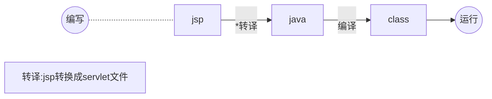

# JSP

### HelloWorld示例

```jsp
<%@ page contentType="text/html;charset=UTF-8" language="java" pageEncoding="UTF-8" %>
<!DOCTYPE html>
<html lang="zh">
<head>
    <meta charset="UTF-8">
    <title>HelloWorld</title>
</head>
<body>
<%
    out.println("HelloWorld");
%>
</body>
</html>
```

### 优点

* 可以编写java代码,使用灵活

### 缺点

* 耦合性高,后期难于维护

### 执行流程



***

### 基本语法

* 声明

  > <%! 代码%>
  >
  > 声明变量和方法

* 脚本

  > <% 代码 %>
  >
  > 逻辑代码,也可以声明

* 表达式

  ><%= 表达式 %>

* 注释

  > <%-- 注释 --%>

***

### 三大指令//todo

#### page

设置页面参数

#### include 

页面包含

#### taglib

引入js标签库

***

### 动作标签

* Jsp:forward

  ```
<jsp:forward page="跳转的目标路径">
		//传参
		<jsp:param name="" value="">
	</jsp:forward>
```
  
* Jsp:param

  ```
  <jsp:param name="" value="">
  ```

* Jsp:include

  ```
  <jsp:include page="被包含的页面路径">
  	<jsp:param name="" value="">
  </jsp:include>
  ```

  

***

### 静态包含


***

### 内置对象

#### 概念

>系统内部默认提供的对象,不需要new创建。

#### 九大内置对象

* Request

* Response
* Page
  
  >  代表JSP本身
* PageContext
  
  >  JSP页面容器,可以获取其它8个内置对象
* Session
  
  >  会话
* Config
  
  >  取得服务器配置信息
* Out
  
  >  页面输出
* Exception
  
  >  只有在包含```isErrorPage```的页面才能使用
  >
  >  ```jsp
  >  <%@ page contentType="text/html;charset=UTF-8" language="java" pageEncoding="UTF-8" isErrorPage="true" %>
  >  ```
* Application
  
  >  全局变量,直到服务器关闭
#### 域对象

具有作用域的对象

##### 四大域对象

* pageContext

  > 在当前页面有效

* request

  > 一次请求

* session

  > 一次会话

* application

  > 整个项目,服务器启动到停止

***

### EL表达式

`Expression language`，简化代码

#### 语法

`${Expression}`

#### 作用域取值

>pageContext.setAttribute("username",liuhaixv);
>**${username};**

##### 作用域获取同名key

>pageContext.setAttribute("username",liuhaixv);
>
>session.setAttribute("username,someone");
>
>//liuhaixv
>
>**$<pageScope.username>**
>
>//someone
>
>**$<sessionScope.username>**

el表达式获取作用域中的参数按照作用域大小范围，从小到大的顺序来查询

#### 运算符//todo

***

### JSTL标签

#### 下载导包

#### 重点标签库

* 核心标签库

  ```
  <%@ taglib prefix="c" uri="http://java.sun.com/jsp/jstl/core" %>
  ```

* 格式化标签库

  ```
  <%@ taglib prefix="fmt" uri="http://java.sun.com/jsp/jstl/fmt" %>
  ```

* 函数标签库

  ```
  
  ```


***

### Q&A

#### JSP和Servlet的区别?

#### 静态包含和动态包含的区别?

>语法格式不一样
>
>静态包含不能传参，动态包含可以传参
>
>静态包含执行之后两个文件编译成一个.java文件，动态包含编译后独立编译成