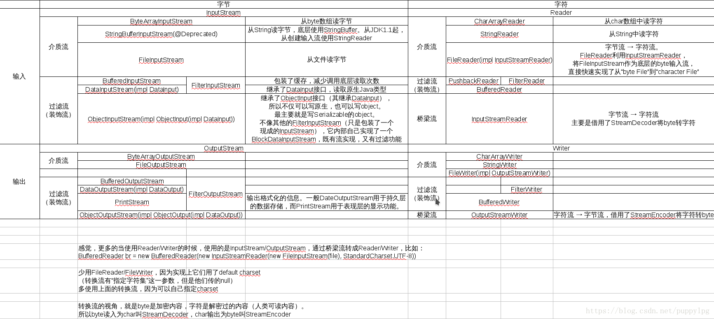

# IO流

* 功能

  字节流:`可以直接操作字节的流对象`

  字符流:`可以直接操作字符的流对象`

* 流向

  输入流:`其它设备到内存的流对象`

  输出流:`内存到其它设备的流对象`

* 体系结构

  * 字节流
  
    InputStream
  
    OutputStream
  
  * 字符流
  
    Reader
  
    Writer

